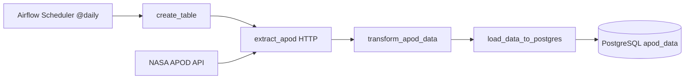
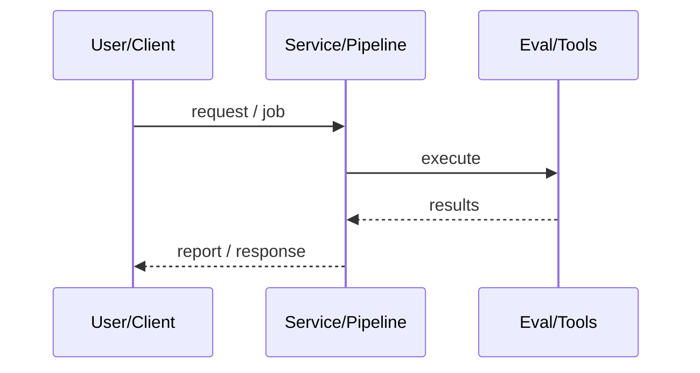
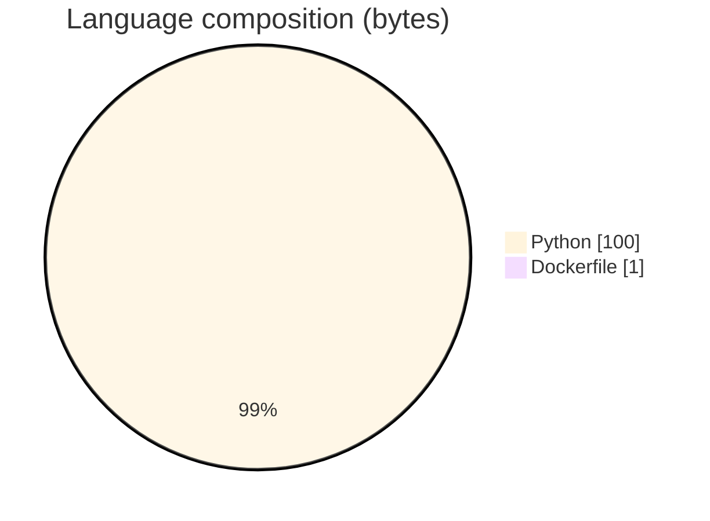

# NASA APOD ETL with Airflow and PostgreSQL

### Daily Airflow DAG extracting NASA Astronomy Picture of the Day into Postgres.

[](https://github.com/ArchanaChetan07/NASA-APOD-ETL-Pipeline-with-Apache-Airflow-PostgreSQL)
[](https://github.com/ArchanaChetan07/NASA-APOD-ETL-Pipeline-with-Apache-Airflow-PostgreSQL)
[](https://github.com/ArchanaChetan07/NASA-APOD-ETL-Pipeline-with-Apache-Airflow-PostgreSQL)
[](https://github.com/ArchanaChetan07/NASA-APOD-ETL-Pipeline-with-Apache-Airflow-PostgreSQL/actions)

---

## Overview

Automate ingest of NASA APOD API records into a queryable database on a schedule.

Airflow DAG nasa_apod_postgres: create_table → SimpleHttpOperator extract_apod → transform_apod_data → load_data_to_postgres via PostgresHook; docker-compose runs Postgres 13 + Airflow 2.8.1 webserver/scheduler.

Working ETL pattern with run logs showing successful scheduled/manual DAG attempts; Astro-style test scaffolding present.

This repository is maintained as **production-minded portfolio work**: clear architecture, automated checks where present, and metrics that are **traceable to committed artifacts** (never invented).

---

## Architecture

Airflow scheduler triggers DAG → ensure apod_data table → HTTP GET planetary/apod → transform selected fields → INSERT into PostgreSQL.





---

## Results & repository facts

> Only values found in code, configs, tests, or generated reports are listed. Absence of a clinical/ML accuracy number means it was **not** published in-repo.

| Metric | Value | Source |
|---|---|---|
| Tracked repository files | **33** | `git tree` |
| DAG schedule | **@daily** | `dags/etl.py` |
| Airflow image version | **2.8.1** | `docker-compose.yml` |
| Postgres host port mapping | **5433:5432** | `docker-compose.yml` |
| Tracked files | **33** | `git tree` |
| Python modules | **4** | `git tree` |
| Test-related paths | **3** | `git tree` |
| CI workflows | **Yes** | `.github/workflows` |
| Docker present | **Yes** | `repo root` |



---

## Key features

- Daily @daily schedule
- HTTP extract via Airflow connection nasa_api
- Postgres table apod_data (title, explanation, url, date, media_type)
- Local docker-compose with ports 8080 (Airflow) and 5433 (Postgres)

---

## Tech stack

| Layer | Technology |
|---|---|
| orchestration | Apache Airflow 2.8.1 |
| database | PostgreSQL 13 |
| containers | Docker Compose |
| api | NASA APOD HTTP API |
| ci | GitHub Actions |

---

## Skills demonstrated

Python · A · p · a · c · h · e · CI/CD · testing · automation

Keyword surface: **Python · Python · machine-learning · CI/CD · testing · API · Docker · automation · data-science · software-engineering · system-design · observability · LLM · cloud**

---

## Project structure

```text
NASA-APOD-ETL-Pipeline-with-Apache-Airflow-PostgreSQL/
├── dags/etl.py
├── docker-compose.yml
├── Dockerfile / requirements.txt / packages.txt
├── logs/dag_id=nasa_apod_postgres/...
├── tests/
├── .astro/
└── .github/workflows/ci.yml
```

---

## Installation & usage

```bash
git clone https://github.com/ArchanaChetan07/NASA-APOD-ETL-Pipeline-with-Apache-Airflow-PostgreSQL.git
cd NASA-APOD-ETL-Pipeline-with-Apache-Airflow-PostgreSQL
docker compose up -d
# Configure Airflow connections: nasa_api + my_postgres_connection
```

---

## How it works

With Compose services up, configure NASA API and Postgres connections in Airflow, then enable dag_id nasa_apod_postgres. Tasks create the table, fetch APOD JSON, map fields, and insert a row. Logs under logs/ show prior successful runs.

---

## Future improvements

- Rotate any documented API keys out of comments
- Add data-quality checks / idempotent upserts by date

---

## License

See repository.

---

<p align="center">
  <b>NASA APOD ETL with Airflow and PostgreSQL</b><br/>
  <a href="https://github.com/ArchanaChetan07/NASA-APOD-ETL-Pipeline-with-Apache-Airflow-PostgreSQL">github.com/ArchanaChetan07/NASA-APOD-ETL-Pipeline-with-Apache-Airflow-PostgreSQL</a>
</p>
